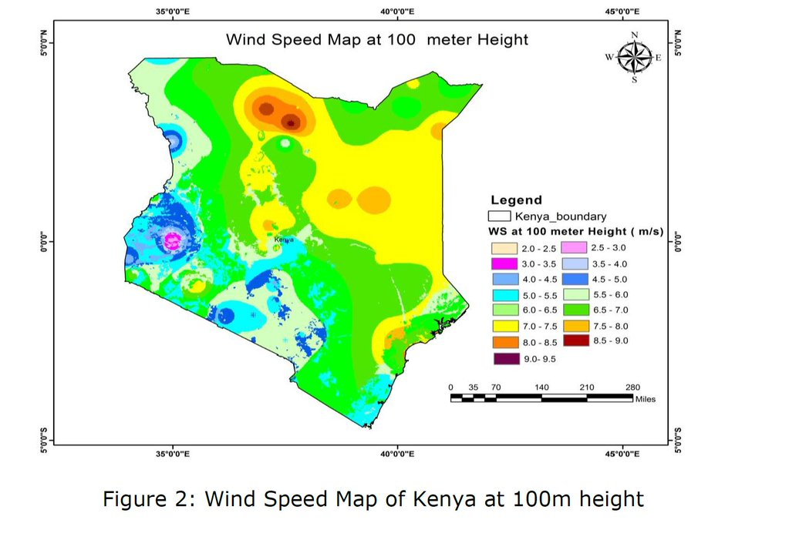
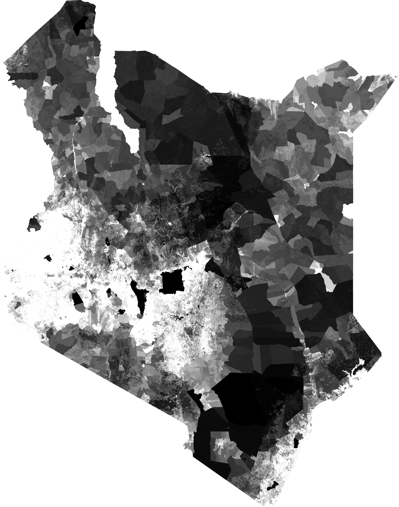

# Notes of Readings before Class 1 

> Power from Perspective

Paper uses Perspective-based variant of scenario-based methodology. 

Developed 7 perspectives:

| Perspective       | Primary Goals                            |
| ----------------- | ---------------------------------------- |
| America-Firsters  | energy independence                      |
| Bottom-Liners     | composed of industrialists who prefer a secure and low-cost national energy portfolio, regardless of its GHG emissions or energy import profile |
| Entrepreneurs     | represents American market-place ingenuity in solving our energy problems |
| Environmentalists | reduce GHG emissions                     |
| Individualists    | maintain the high quality of life in the United States |
| Politicians       | be as accommodating to as many interests as possible in the implementation of national energy policies |
| Technophiles      | advocates a ‘big engineering’ approach to achieving energy independence and GHG emissions. |

Conclusions:

- achieving energy independence, energy security, and GHG reductions can indeed be accomplished in radically different manners. 
- sometimes a focus on one goal led to the achievement of another
- there are other mechanisms or approaches, for example ‘cap and invest’, that could be as effective and maybe more politically acceptable than a ‘cap and trade’ program
- Government must play a strong role in addressing long-term US energy issues

> Levelized cost of electricity for solar photovoltaic and electrical energy storage

- proposes levelized cost of delivery (LCOD) over levelized cost of energy (LCOE) to adequately address PV with energy storage options
- focus solar irradiation in South Africa (assumed to be similar to Kenya), energy demand curve from Kenya
- From investment POV, it can be important to add a battery as a component of the system rather than adding it in a later stage. The costs for separating the system can be high compared to considering the costs as a whole.
- Vanadium redox flow battery found to have a lower LCOD over Li-ion batteries at low discount rate for energy storage

> Can solar panels leapfrog power grids? The World Bank experience 1992–2009

- in remote areas with low population densities, it can be cheaper to provide decentralized renewable power through home systems or mini-grids than to extend the main electric grid.
- solar PV projects supported by the World Bank loan were generally small in scale and had achieved little impact on GHG emissions reduction.
- Solar Home Systems (SHSs) can leapfrog power grids at least for households with access to good microfinance services, even though in many places, markets are still reliant on subsidies. However, if solar modules continue to get cheaper as the trend in recent years shows, the solar subsidy itself could be leapfrogged.

> RIA of the Kenya National Transmission Grid Code + Kenya National Distribution Code

- addresses weaknesses in 2008 version of Codes
- imperative that the Kenya system be well equipped to deal with intermittency from renewable resources, and that the Kenya grid codes include adequate performance requirements to ensure safe and reliable operations, and that the system operates efficiently and economically, thereby attracting new investments in generation and transmission infrastructure.

> Feasibility study of small Hydro/PV/Wind hybrid system for off-grid rural electrification in Ethiopia

- analysis done by Addis Ababa Institute of Technology Dept ECE in Ethiopia for specific site
- developed simulation of variable energy production from renewable sources (HOMER)
- advocates hydropower, low solar and wind generation at site, but could be combined with diesel generator and battery to maintain reliability

> Kenya DRAFT NATIONAL ENERGY AND PETROLEUM POLICY (2015)

- The  overall  objective  of  the  energy  and  petroleum  policy  is  to  ensure  affordable,  competitive,  sustainable  and  reliable  supply  of  energy  to  meet  national  and  county  development  needs  at  least cost, while protecting and conserving the environment.
- Document lays vision for 2030.
- Oil was found in March 2012, advocates data acquisition of site to make more attractive to extract ($$)
- Labels "Coal  [as]  an  affordable,  competitive,  reliable  and  easily  accessible  source  of  energy,  especially  for  electricity  generation. "
  - "[Kenya] shall  promote  an  intensive  coal  exploration  programme  and  efficient  utilisation  of  coal  resources  while  minimising  the  environmental  impacts  associated  with  its  use. "
- Includes hydro in renewable energy definition.
- Estimates 6 GW of hydro potential b/t big (>10MW) and small. Only 807 (of 3,000) / 25 (of 3,000) MW have been developed. Hydro already is a big portion of current electricity generation.

> U.S. Energy flow - "quad" chart

- NG largest single source of energy
- Net importer of energy
- Industrial uses still largest user of energy, followed by transportation (together 58%)

> Wind sector prospectus - Kenya

- 2 GW of installed wind capacity by 2030
- "The  Wind  Resource  Assessment  carried  out  by  WinDForce  shows  that  over 73% of the total area of the country experiences annual mean wind-speeds more than 6 m/s at 100 m above ground."
- Kenya dry season significantly affects power generation (since so heavily dependent on hydro)
- Feed in Tariff (FiT) - policy tool to give long-term contracts to renewable energy produces that award a lower per-kWh price.
  - Kenya's  FIT  policy  provides  for  wind generated  electricity  a  fixed  tariff  of  the  order  of  US  $  Cents  11.0  per kilowatt-hour of electrical energy supplied in bulk to the grid operator at the interconnection  point.  This  tariff  applies  to  individual  wind  power plants (wind farms) whose effective generation capacity is above 500 kW and does not exceed 100 MW
- Identifies areas for wind potential

> Feasibility study for a standalone solar–wind-based hybrid energy system for application in Ethiopia

- focus in Ethiopia
- replace reliance of dirty burning of biomass
- simulation developed to compare optimal combinations of PV, wind turbine, generator, converter, and battery storage, using HOMER from NREL.
- Achieve between 51 and 81% renewable resource utilization at a levlized costs between 0.383 \$/kWh to 0.464 \$/kWh 

> COUNTRY STRATEGY PAPER 2014-2018

Goals:

1. Enhancing physical infrastructure to unleash inclusive growth

2. Developing skills for the emerging labour market of a transforming economy. 

   > The overarching challenge Kenya is facing today is to generate economic growth that is more inclusive in order to more effectively reduce poverty across the country. 

> Development of an optimal biogas system design model forSub-Saharan Africa with case studies from Kenya and Cameroon

